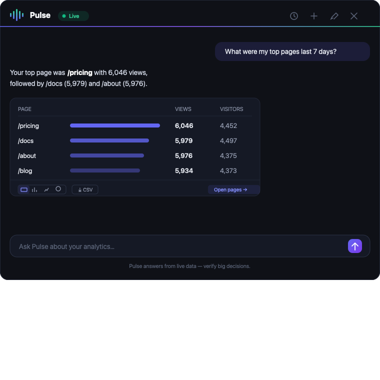

<div align="center">

# 📊 InsightsTrack

### Self-hosted, privacy-first web analytics — the open-source alternative to Google Analytics

[](https://doi.org/10.5281/zenodo.22148654)
[](LICENSE)
[]()
[]()
[]()
[](https://github.com/sponsors/NishikantaRay)

**Track visitors, pageviews, conversions, heatmaps, and Core Web Vitals — all on your own server.**
No cookies, no consent banners, no data selling. Deploy in under 15 minutes.

[Live Demo](#-live-demo) · [Quick Start](#-quick-start) · [Features](#-feature-walkthrough) · [Deploy](#-deploy-your-own) · [Docs](docs/)


</div>

---

## What is InsightsTrack?

InsightsTrack is a complete, production-grade web analytics platform you run yourself. It gives you the depth of Google Analytics 4 — real-time visitors, traffic sources, funnels, heatmaps, Web Vitals — without sending a single byte of your visitors' data to a third party.

**Why teams choose it:**

- 🔒 **Privacy by design** — no cookies, no fingerprinting, pseudonymous visitor IDs, no stored IP addresses, and DNT/GPC opt-out honored in both the tracking script and the API. GDPR-friendly by design; compliance depends on your deployment.
- ⚡ **Built for analytical reads** — a dual-database design (PostgreSQL for writes, DuckDB for reads). In an isolated local test with ~101K events, representative 90-day analytics requests completed in well under 100 ms measured at the **HTTP/API layer** (which includes the application response cache). That is not a measurement of DuckDB execution time and is not a guarantee at larger datasets — see [`docs/PERFORMANCE_BENCHMARK_AUDIT.md`](docs/PERFORMANCE_BENCHMARK_AUDIT.md).
- 🧩 **Everything in one place** — 17 analytics pages: dashboard, pages, realtime, funnels, heatmaps, engagement, performance, audience, acquisition, conversions, user flow, reporting studio, SQL editor, and more.
- 🤖 **Pulse, your AI analyst** — ask your data anything in plain English and get real charts, tables, and CSVs. Also works from Claude Desktop & Cursor over MCP. [Jump to Pulse →](#-pulse--your-ai-analyst)
- 🪶 **Single tag** — one `<script>` tag (~7.5 KB gzipped in the current build; exact size varies with build and transfer encoding), works with any site (WordPress, Next.js, Shopify, plain HTML…).
- 👥 **Team-ready** — invite teammates, assign roles, build custom permission roles, and control which pages each member sees.
- 💸 **Free forever** — MIT licensed, self-hosted, no seat limits.

### How it works

```
┌──────────────┐   POST /api/track/*    ┌──────────────────────────────┐
│  Your website│──────────────────────▶ │  Backend API (Express, :3001)│
│  (one tag)   │                        │                              │
└──────────────┘                        │  ┌──────────┐   ┌──────────┐ │
                                        │  │ Postgres │──▶│  DuckDB  │ │
┌──────────────┐  GET /api/analytics/*  │  │ (writes) │sync│ (reads)  │ │
│  Dashboard   │◀────────────────────── │  └──────────┘   └──────────┘ │
│  React SPA   │                        └──────────────────────────────┘
└──────────────┘
```

All **writes** (tracking events, auth, sites) go to **PostgreSQL**. A background sync streams them into **DuckDB**, an embedded columnar engine that powers every **analytics read**. Columnar storage suits the wide aggregations analytics dashboards issue; actual performance depends on workload, dataset, hardware, and query shape. A reproducible benchmark comparing both engines on identical generated data — including the methodology, its limitations, and the raw measurements — is in [`docs/PERFORMANCE_BENCHMARK.md`](docs/PERFORMANCE_BENCHMARK.md). The dashboard never queries PostgreSQL directly.

> **Project layout.** This repository uses a split-service layout:
> - **`apps/analytics-api/`** — the unified backend: Express API, PostgreSQL writes, DuckDB analytics reads, and the PostgreSQL→DuckDB sync worker (`:3001`).
> - **`apps/dashboard-web/`** — the React dashboard (`:4173`).
> - **`archive/analytics-api-legacy/`** — the legacy write/auth service, retained for reference only.
> - **`appsv2/`** — a secondary working copy kept in sync with `apps/`. **`apps/` is canonical**; despite the name, `appsv2/` is not a newer version. See [`appsv2/README.md`](appsv2/README.md).

---

## 🎬 Live Demo

The landing page ships a **live demo instance** so anyone can explore the full product with realistic sample data before installing anything.

| | |
|---|---|
|  |  |
| **Landing page** — open-source banner, live demo notice, and clear CTAs. | **Light & dark mode** — the whole site (and app) supports both. |

**Two paths from the landing page:**

1. **Open live dashboard** → log in or sign up → you're dropped straight into a dashboard pre-loaded with demo data (the `hello.com` sample site). Great for evaluating features.
2. **Set up your own instance** → sign up for a fresh account → onboarding walks you through adding your first site and tracking script.

---

## 🚀 Quick Start

The fastest way to run the whole stack (PostgreSQL + API + dashboard + a demo site) is Docker.

### Prerequisites
- **Docker** & **Docker Compose** (recommended), or **Node.js 20+** + **PostgreSQL 16** for manual setup.

### One command (Docker)

```bash
git clone https://github.com/NishikantaRay/InsightTrack.git
cd InsightTrack

cp .env.example .env          # fill in passwords / secrets
docker-compose up --build -d
```

| Service | URL |
|---------|-----|
| 📊 Dashboard | http://localhost:4173 |
| 🔌 Backend API | http://localhost:3001 |
| 🌐 Demo site (sample tracked page) | http://localhost:8080 |
| 🗄️ pgAdmin (DB browser) | http://localhost:5050 |

Open the dashboard, register an account, and you're live.

### Manual setup (no Docker)

Requires **Node.js 20+** and a running **PostgreSQL**.

```bash
# 1. Backend — Express + PostgreSQL (writes) + DuckDB (analytics reads)
cd apps/analytics-api
npm install
cp .env.example .env   # PG_*, JWT_SECRET, and everything else — see below
npm run migrate        # create PostgreSQL tables
npm run seed           # generate sample data (optional)
npm run init           # create DuckDB tables
npm run sync           # sync PostgreSQL → DuckDB
npm start              # → http://localhost:3001

# 2. Dashboard — in a second terminal
cd apps/dashboard-web
npm install
cp .env.example .env   # sets VITE_API_URL=http://localhost:3001
npm run dev            # → http://localhost:5173 (dev) / 4173 (preview)
```

> **Full walkthrough**, including starting PostgreSQL in a container and the
> troubleshooting steps, is in **[docs/running-locally.md](docs/running-locally.md)**.
> That document is the authoritative manual-setup reference.

**Configuration:** [`apps/analytics-api/.env.example`](apps/analytics-api/.env.example)
is the complete backend configuration reference — PostgreSQL connection, JWT,
DuckDB path, sync tuning, cache TTLs, rate limits, and optional integrations.
The root [`.env.example`](.env.example) configures the **Docker Compose** stack
only and is not a substitute for it.

### Add tracking to your website

After creating a site in **Settings**, paste this once into your site's `<head>`:

```html
<script src="http://localhost:3001/api/sites/YOUR_SITE_ID/script"></script>
```

Pageviews, sessions, clicks, scroll depth, Web Vitals, JS errors, and heatmap data start flowing immediately — no extra configuration.

> Full local walkthrough: [docs/running-locally.md](docs/running-locally.md)

---

## ✨ Feature Walkthrough

### 🌟 Pulse — your AI analyst


**Ask your analytics anything in plain English.** Pulse is a built-in AI analyst that turns questions into real answers — *"top pages last 7 days"*, *"where's my traffic from?"*, *"how's my funnel doing?"* — backed by live data, never invented.

- **Real charts, tables & CSV** — every answer renders as a chart, table, or KPI card. Switch the view (table ↔ bar ↔ line ↔ donut), export to CSV, or deep-link straight to the matching dashboard page.
- **Read-only & safe** — Pulse calls a fixed catalogue of read-only analytics tools. It can query, but can never change settings or delete data, and every number is backed by a real tool call.
- **Works in Claude Desktop, Cursor & any MCP client** — the same tools are exposed over the [Model Context Protocol](https://modelcontextprotocol.io). Connect via a remote URL or a local bridge, then ask Claude Desktop about your traffic and it queries InsightTrack directly. See [`docs/ai-analyst.md`](docs/ai-analyst.md) and [`docs/mcp-toolkit.md`](docs/mcp-toolkit.md).
- **Bring your own key** — Anthropic (Claude), OpenAI (GPT), or Google (Gemini). Stored encrypted at rest (AES-256-GCM), never leaves your server. Or set a server key so the panel just works.
- **Session memory** — every conversation is saved and resumes where you left off; follow-ups keep context.

```jsonc
// Claude Desktop / Cursor — connect over MCP (remote, nothing to install)
{
  "mcpServers": {
    "insighttrack": {
      "type": "http",
      "url": "https://analytics.example.com/api/mcp/http",
      "headers": { "Authorization": "Bearer <your connect token>" }
    }
  }
}
```

### Dashboard


The home view: KPI cards (visitors, pageviews, bounce rate, avg. session) with trends and sparklines, traffic & pageviews charts, top pages, traffic sources donut, devices, countries leaderboard, the conversion funnel, and a live world map — all for the selected date range, auto-refreshing.

### Real-time


Live visitor count, active pages, an interactive world map of current visitors, and a device breakdown — refreshing every few seconds.

### Visual Heatmap


Click-density dots overlaid on a live preview of any tracked page — indigo (rare) → red (hottest). A Click Distribution table ranks every element by clicks and unique users. Filter by device, cluster nearby clicks, and export to CSV.

### Engagement & Performance

|  |  |
|---|---|
| **Engagement** — scroll-depth milestones (25/50/75/100%), rage-click detection, and time-on-page behaviour. | **Performance** — Core Web Vitals (LCP, FID, CLS, INP, TTFB) scored against Google thresholds, plus a JS error log with trend chart. |

### Funnels & Conversions

|  |  |
|---|---|
| **Funnels** — define multi-step journeys and see exact drop-off between stages. | **Conversions** — track goals and conversion rates over time. |

### Audience, Acquisition & Pages

|  |  |
|---|---|
| **Audience** — devices, browsers, OS, countries, returning vs. new. | **Acquisition** — traffic sources, referrers, and UTM campaign breakdown. |


**Pages** — every tracked URL with views, unique visitors, and % of total. Sortable, filterable, CSV/JSON export.

### Reporting Studio & SQL Editor

|  |  |
|---|---|
| **Reporting Studio** — drag-and-drop custom dashboards, scheduled email reports, shareable links. | **SQL Editor** — run read-only DuckDB queries directly against your analytics data, with schema browser and saved queries. |

### User Flow & Dark Mode

|  |  |
|---|---|
| **User Flow** — how visitors move between pages, entry → transitions → exits. | **Dark mode** — full app theming, system-preference aware. |

### Team, Settings & Profile

|  |  |
|---|---|
| **Settings** — manage multiple sites, copy the tracking script, configure traffic-spike alerts. | **Profile** — General, Security, **Team** (invite members, custom roles), and per-member Feature Manager. |

> Team access, custom roles, and the live-demo join flow are documented in [docs/team-access.md](docs/team-access.md).

---

## 🛳️ Deploy Your Own

### Docker (fastest)

```bash
git clone https://github.com/NishikantaRay/InsightTrack.git
cd InsightTrack
cp .env.example .env
docker-compose up --build -d
```

This builds the `apps/analytics-api` backend (`:3001`), the `apps/dashboard-web` UI (`:4173`), a demo site (`:8080`), PostgreSQL (`:5432`), and pgAdmin (`:5050`).

### Manual

```bash
# Backend
cd apps/analytics-api
cp .env.example .env        # set PG_* / DATABASE_URL, JWT_SECRET, APP_BASE_URL
npm install && npm run migrate && npm run init && npm start   # :3001

# Frontend
cd apps/dashboard-web
npm install && npm run build && npm run preview               # :4173
```

### Cloud (Railway / Render + Vercel / Cloudflare Pages)

- **Backend** → Railway or Render. Add a PostgreSQL plugin (sets `DATABASE_URL`), set Root Dir to `apps/analytics-api`, Start command `npm run migrate && npm run init && npm start`, and attach a volume at `/data` for the DuckDB file.
- **Frontend** → Vercel, Cloudflare Pages, or Netlify. Root Dir `apps/dashboard-web`, build `npm run build`, output `dist`, and set `VITE_API_URL` to your backend URL.

Full production guide (Nginx, SSL, backups, env vars): [docs/deployment.md](docs/deployment.md)

---

## 🔑 Key Environment Variables

| Variable | Default | Description |
|----------|---------|-------------|
| `PORT` | `3001` | API server port |
| `DATABASE_URL` | `postgresql://…@localhost:5432/analytics` | PostgreSQL connection string |
| `JWT_SECRET` | _(set in production)_ | Secret for signing JWTs (≥ 32 random bytes) |
| `APP_BASE_URL` | `http://localhost:4173` | Frontend URL for team invite links |
| `DEMO_SITE_DOMAIN` | `hello.com` | Domain of the public demo site for the "Open live dashboard" CTA |
| `DUCKDB_PATH` | `duckdb/analytics.duckdb` | Path to the DuckDB file (use a volume in production) |
| `DUCKDB_POOL_SIZE` | `4` | DuckDB connection pool size |
| `SYNC_DEBOUNCE_MS` | `5000` | Debounce window before PG→DuckDB sync after a tracking event |
| `CORS_ORIGINS` | `localhost:4173,…` | Comma-separated allowed origins |

---

## 🗂️ Project Structure

```
InsightsTrack/
├── apps/
│   ├── analytics-api/             # Backend: Express + PostgreSQL + DuckDB (:3001)
│   │   └── src/{db,routes,services,queries,sync,schema,mcp}/
│   ├── dashboard-web/             # React 18 + Vite + Tailwind dashboard (:4173)
│   ├── mcp-server/                # stdio MCP bridge (Claude Desktop / Cursor)
│   └── mcp-toolkit-core/          # OpenAPI→MCP mapping engine
├── archive/analytics-api-legacy/  # Legacy write/auth service (reference)
├── examples/                      # demo-blog · demo-site · demo-website
├── scripts/                       # seed-live-demo.js, helpers
├── screenshots/                   # Product screenshots used in this README
├── docs/                          # Full documentation
└── docker-compose.yml             # Full stack
```

---

## 🧱 Tech Stack

| Layer | Technology |
|-------|-----------|
| Frontend | React 18, Vite 5, Tailwind CSS 3, Recharts, Zustand, React Router 6 |
| Backend | Node.js 20, Express 4 |
| Write DB | PostgreSQL 16 — tracking events, auth, sites, teams |
| Read DB | DuckDB (embedded columnar) — analytics queries |
| Auth | JWT (7-day expiry), bcrypt |
| Caching | In-memory TTL cache + request coalescing |
| Testing | Vitest, Supertest, Playwright |

---

## 🔌 API Overview

| Group | Key Endpoints | DB |
|-------|---------------|-----|
| **Auth** | `POST /api/auth/register` · `/login` · `GET /api/auth/me` | PostgreSQL |
| **Sites** | `GET/POST /api/sites` · `GET /api/sites/:id/script` | PostgreSQL |
| **Tracking** | `POST /api/track/event` · `/pageview` · `/batch` · `GET /api/track/pixel.gif` | PostgreSQL |
| **Analytics** | `/api/analytics/:siteId/{kpi,traffic,top-pages,sources,devices,countries,realtime,user-flow,funnel,…}` | DuckDB |
| **Engagement** | `/engagement/{scroll-depth,rage-clicks,heatmap,time-on-page}` | DuckDB |
| **Performance** | `/performance/{web-vitals,errors,errors-over-time}` | DuckDB |
| **Team** | `/api/team/:siteId/{members,invite,roles}` · `/api/demo/join` | PostgreSQL |
| **Pulse (AI)** | `POST /api/assistant/chat` (SSE) · `GET /api/assistant/{status,threads}` · `PUT /api/assistant/settings` | DuckDB (read-only tools) |
| **MCP** | `POST /api/mcp/http` (JSON-RPC 2.0) · `/api/mcp/connect` · `/api/mcp/run` | DuckDB (read-only tools) |

All analytics endpoints accept `?dateRange=today|7d|30d|90d|custom:YYYY-MM-DD:YYYY-MM-DD`.
Full reference: [docs/api-reference.md](docs/api-reference.md)

---

## 📚 Documentation

| Document | What's inside |
|----------|---------------|
| [Getting Started](docs/getting-started.md) | Setup from scratch |
| [Running Locally](docs/running-locally.md) | Detailed local dev walkthrough |
| [Deployment](docs/deployment.md) | Production: Docker, Nginx, SSL, Railway |
| [Tracking Script](docs/tracking-script.md) | How tracking works, SPA support, custom events |
| [API Reference](docs/api-reference.md) | Full REST API with examples |
| [Architecture](docs/architecture.md) | System design & data flow |
| [Team Access](docs/team-access.md) | Multi-user, custom roles, live-demo flow |
| [Visual Heatmap](docs/heatmap.md) | Heatmap feature deep-dive |

---

## Running Tests

```bash
cd apps/analytics-api && npm test                 # backend (Vitest + Supertest)
cd apps/dashboard-web && npm test                 # frontend unit tests
cd apps/dashboard-web && npm run test:e2e         # end-to-end (needs the stack running)
```

---

## ❤️ Support

InsightsTrack is free and open source. If it's useful to you, please consider
**[sponsoring on GitHub](https://github.com/sponsors/NishikantaRay)** — it directly
funds new features, maintenance, and keeping the project free for everyone.

[](https://github.com/sponsors/NishikantaRay)

A ⭐ on the repo also helps a lot!

---

## License

[MIT](LICENSE) — free to self-host, modify, and run forever.
