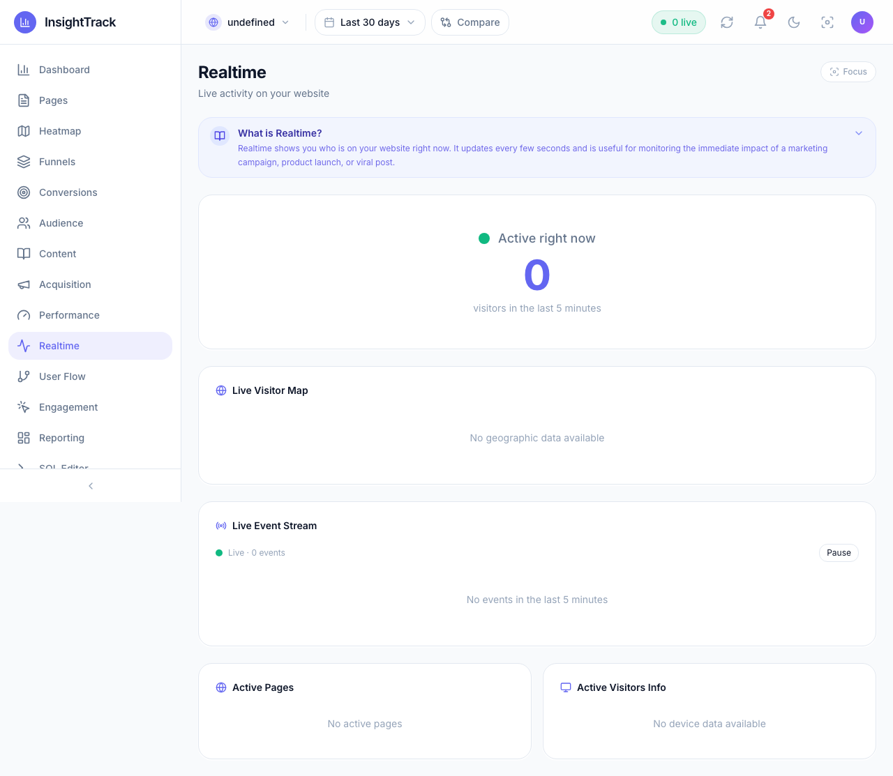

# Analytics Dashboard

This package contains the React/Vite frontend for InsightTrack.

## Development

```bash
npm install
npm run dev      # start dev server on port $VITE_DEV_PORT (default 5173)
```

## Testing

Unit tests use [Vitest].

```bash
npm run test      # run all unit tests
npm run test:watch
```

End-to-end browser tests are powered by [Playwright]. Before running them make sure the dashboard is available on `http://localhost:$VITE_DEV_PORT` (run `npm run dev` in a separate shell).

```bash
npm run test:e2e          # headless
npm run test:e2e:headed   # with browser UI
```

Playwright config lives in `playwright.config.js` and the tests themselves are in `e2e/`.

[Vitest]: https://vitest.dev/
[Playwright]: https://playwright.dev/

## New Features (2026)

### 🌍 Live Visitor Map (react-leaflet)
- Interactive world map powered by [react-leaflet](https://react-leaflet.js.org/) and OpenStreetMap tiles
- Real-time country markers sized by active visitors
- Drag, zoom, scroll, and pinch-to-zoom support
- Hover tooltips show country and visitor count
- Fully supports dark mode



### ⚡ Real-Time Event Stream
- Live feed of pageviews, clicks, and custom events as they happen
- Color-coded event icons, device/country info, and relative timestamps
- Pause/resume, new-event highlighting, and smooth auto-refresh


### Visual Improvements
- Modern choropleth map style (blue for water, indigo markers)
- Responsive, mobile-friendly layout
- Improved dark mode and accessibility

---