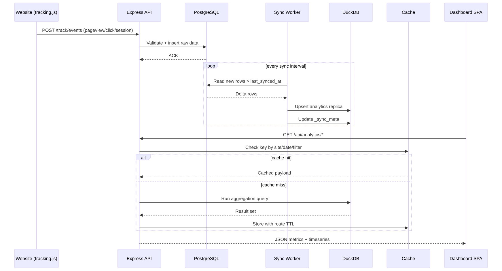

# Project Architecture

## System Overview



PNG fallback: [system-overview.png](./diagrams/system-overview.png)

### Database Interaction Diagram



PNG fallback: [database-interaction.png](./diagrams/database-interaction.png)

### Dashboard Request Workflow



PNG fallback: [dashboard-workflow.png](./diagrams/dashboard-workflow.png)

## Dual-Database Architecture

InsightTrack uses a **write-read split** across two databases:

| Database | Role | Operations |
|----------|------|-----------|
| **PostgreSQL** | Source of truth | Tracking events, auth, sites, funnels |
| **DuckDB** | Analytics engine | All 17 analytics GET endpoints |

**Why?** PostgreSQL (row-store) excels at ACID writes. DuckDB (column-store) is designed for analytical aggregations — it reads only the columns a query touches, rather than whole rows. This repository does not contain a reproducible PostgreSQL baseline, so no speed multiple is claimed.

Data flows: Website → Tracking API → PostgreSQL → (sync) → DuckDB → Analytics API → Dashboard.

> For the full dual-database deep-dive, see [backend-architecture.md](./backend-architecture.md) and [duckdb-guide.md](./duckdb-guide.md).

## Data Flow

1. **Collection**: The tracking script on your website sends events (`pageview`, `click`, `session`) to the API via `navigator.sendBeacon` or `fetch`
2. **Ingestion**: The tracking routes validate and insert events into PostgreSQL
3. **Sync**: Incremental high-water-mark sync copies new rows from PostgreSQL → DuckDB
4. **Query**: Analytics routes run aggregation queries against DuckDB (21 query functions)
5. **Cache**: Frequently accessed queries are cached in-memory (10s for realtime, 30s KPI, 60s traffic, 120s general)
6. **Display**: The React dashboard fetches data via Axios and renders charts with Recharts

## Database Schema

### PostgreSQL Tables (Source of Truth)

| Table | Purpose |
|-------|---------|
| `events` | Raw event log (pageviews, clicks, custom events) |
| `sessions` | Session metadata (duration, page count, entry/exit pages) |
| `sites` | Registered websites |
| `funnels` | Funnel definitions with ordered steps |
| `daily_stats` | Pre-aggregated daily metrics |
| `users` | User accounts for dashboard authentication |

### DuckDB Tables (Analytics Replica)

| Table | Synced From |
|-------|-------------|
| `events` | PostgreSQL `events` |
| `sessions` | PostgreSQL `sessions` |
| `sites` | PostgreSQL `sites` |
| `funnels` | PostgreSQL `funnels` |
| `daily_stats` | PostgreSQL `daily_stats` |
| `users` | PostgreSQL `users` |
| `_sync_meta` | Internal — tracks last sync timestamp per table |

### Key Indexes

- `events`: Indexed on `(site_id, timestamp)` for time-range queries
- `sessions`: Indexed on `(site_id, started_at)`
- `users`: Unique index on `email`

## Frontend Architecture

```
src/
├── components/
│   ├── charts/         # Data visualization (Recharts wrappers)
│   ├── layout/         # App shell (Sidebar, Navbar, DashboardLayout)
│   └── ui/             # Reusable UI (MetricCard, DataTable, DateFilter, etc.)
├── hooks/              # Data-fetching hooks (useAnalytics)
├── pages/              # Route-level components
├── services/           # API client (Axios instance + interceptors)
├── store/              # Zustand stores (auth, theme, site, dateFilter)
└── utils/              # Formatters, export helpers
```

### State Management

- **useAuthStore**: JWT token, user object, login/logout
- **useThemeStore**: Dark/light mode toggle
- **useSiteStore**: Active website selection
- **useDateFilterStore**: Date range + custom range

### Route Structure

| Route | Page | Auth |
|-------|------|------|
| `/login` | Login | Guest only |
| `/register` | Register | Guest only |
| `/` | Dashboard | Protected |
| `/pages` | Page Analytics | Protected |
| `/funnels` | Conversion Funnels | Protected |
| `/realtime` | Real-time Visitors | Protected |
| `/user-flow` | User Flow Analysis | Protected |
| `/settings` | Site Management | Protected |
| `/profile` | User Profile | Protected |

## Backend Architecture

```
apps/analytics-api/src/
├── db/
│   ├── postgres.js       # PostgreSQL pool & connection management
│   └── duckdb.js         # DuckDB connection (embedded, in-process)
├── middleware/
│   └── auth.js           # JWT verification middleware
├── routes/
│   ├── analytics.js      # GET endpoints → DuckDB queries
│   ├── auth.js           # Registration, login, profile → PostgreSQL
│   ├── sites.js          # Site CRUD + tracking script → PostgreSQL
│   └── tracking.js       # Event ingestion → PostgreSQL
├── services/
│   ├── analyticsService.js  # Orchestrates DuckDB query functions
│   ├── authService.js       # Password hashing, JWT signing
│   ├── cache.js             # In-memory cache with TTL presets
│   ├── sitesService.js      # Site management + script generation
│   └── trackingService.js   # Event validation and insertion
├── queries/
│   └── analytics.js      # 21 DuckDB analytical query functions
├── scripts/
│   ├── migrate.js         # Create PostgreSQL tables
│   ├── seed.js            # Generate sample data
│   ├── init.js            # Create DuckDB tables
│   └── sync.js            # Incremental PG → DuckDB sync
└── index.js              # Express app setup, middleware, server start
```

> For the full backend deep-dive (35 endpoints, caching TTLs, security layers), see [backend-architecture.md](./backend-architecture.md).

### Security Layers

1. **Helmet**: Secure HTTP headers
2. **CORS**: Configured origin whitelist
3. **Rate Limiting**: 100 req/min per IP
4. **JWT Auth**: Protected dashboard API routes
5. **bcrypt**: Password hashing (12 rounds)
6. **Input Validation**: Request body validation on all endpoints
