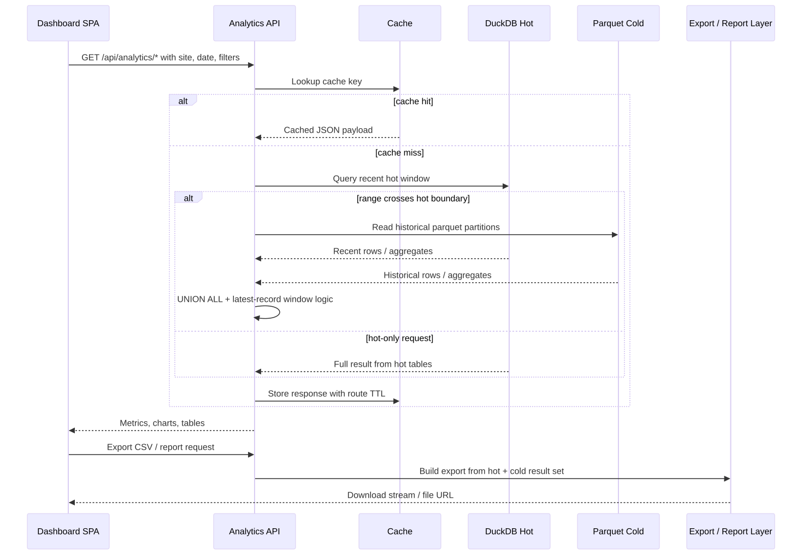

# Future Plan: Hot + Cold Analytics Architecture

This document describes a **future-state architecture plan** for evolving InsightTrack from the current PostgreSQL → DuckDB replica model into a modern hybrid analytics architecture with:

- **PostgreSQL** as the write system of record
- **DuckDB** for fast analytics on recent **hot** data
- **Parquet** for long-term **cold** storage in a data lake style
- **Clear separation of storage and compute** so multiple engines can read the same data

> This is a proposed roadmap design, not the current production architecture described in `docs/architecture.md`.

## Architecture diagram



PNG fallback: [hot-cold-analytics-architecture.png](./diagrams/hot-cold-analytics-architecture.png)

## Database and storage interaction diagram



PNG fallback: [hot-cold-database-interaction.png](./diagrams/hot-cold-database-interaction.png)

## Dashboard request workflow diagram



PNG fallback: [hot-cold-dashboard-workflow.png](./diagrams/hot-cold-dashboard-workflow.png)

## End-to-end flow

```text
Browser / SDK
   → Tracking API (Node.js / Express)
   → PostgreSQL (canonical write store)
   → Incremental sync worker
      → DuckDB managed tables for hot data
      → Parquet partitions for cold data
   → Analytics API
      → cache lookup
      → DuckDB query engine reads hot tables + cold parquet
   → Dashboard / exports / reports
```

### Practical role of each layer

| Layer | Responsibility | Notes |
|---|---|---|
| Frontend tracker | Send `pageview`, `click`, `session` events | Prefer `sendBeacon` with `fetch` fallback |
| Tracking API | Validate, enrich, and write | Writes go to PostgreSQL only |
| PostgreSQL | Source of truth for operational correctness | Best place for ACID writes, auth, sites, sessions |
| Sync worker | Incrementally moves and reshapes data | Owns watermarks, batching, retries, idempotency |
| DuckDB hot store | Recent, heavily queried data | Last 7–30 days is a common starting window |
| Parquet cold store | Cheap long-term columnar storage | Partitioned by event date and optionally site |
| Analytics API | Serves dashboard queries | Can combine DuckDB tables and Parquet in one query |
| Cache | Protects query layer from repeated requests | In-memory first, Redis optional later |

## Incremental sync using a high-water mark

The sync worker should maintain a **high-water mark** per replicated dataset. This is the maximum source position that has been successfully processed.

### Recommended metadata tables

In PostgreSQL, keep a source-side metadata table so the worker can resume safely:

```sql
CREATE TABLE sync_state (
  pipeline_name TEXT PRIMARY KEY,
  last_event_id BIGINT,
  last_updated_at TIMESTAMPTZ,
  last_exported_partition DATE,
  updated_at TIMESTAMPTZ NOT NULL DEFAULT NOW()
);
```

In DuckDB, keep a mirror of operational sync metadata for observability:

```sql
CREATE TABLE IF NOT EXISTS _sync_meta (
  pipeline_name VARCHAR,
  last_event_id BIGINT,
  last_updated_at TIMESTAMP,
  synced_at TIMESTAMP DEFAULT CURRENT_TIMESTAMP
);
```

### Recommended watermark strategy

Use **two watermarks**, not one:

1. **`last_event_id`** for append-only ingestion order
2. **`last_updated_at`** for catching updates to previously written rows

This matters because events are mostly append-only, but sessions and derived rows may be updated after initial insert.

### Worker algorithm

1. Read current watermark from `sync_state`
2. Fetch rows from PostgreSQL with a bounded batch
3. Write batch into DuckDB hot tables using idempotent upsert logic
4. Export old rows to Parquet partitions when they age out of the hot window
5. Advance watermark **only after** DuckDB and Parquet writes succeed
6. Commit sync metadata

### Example PostgreSQL fetch query

```sql
SELECT *
FROM events
WHERE id > $1
ORDER BY id ASC
LIMIT $2;
```

For mutable entities such as sessions, use `updated_at`:

```sql
SELECT *
FROM sessions
WHERE updated_at > $1
ORDER BY updated_at ASC, id ASC
LIMIT $2;
```

### Node.js worker shape

```js
async function syncEventsBatch({ pg, duck, batchSize, hotDays }) {
  const state = await getSyncState(pg, 'events');
  const rows = await pg.query(
    `SELECT *
       FROM events
      WHERE id > $1
      ORDER BY id ASC
      LIMIT $2`,
    [state.last_event_id ?? 0, batchSize]
  );

  if (rows.rows.length === 0) return { processed: 0 };

  await upsertHotEvents(duck, rows.rows);
  await exportColdPartitions(duck, hotDays);

  const lastRow = rows.rows[rows.rows.length - 1];
  await updateSyncState(pg, 'events', {
    last_event_id: lastRow.id,
    last_updated_at: lastRow.updated_at ?? lastRow.timestamp,
  });

  return { processed: rows.rows.length };
}
```

## Splitting hot data and cold data

The practical model is:

- **Hot data in DuckDB tables**: frequently queried recent data, for example last **7, 14, or 30 days**
- **Cold data in Parquet**: older partitions written once and read many times

### Recommended starting policy

- Keep **last 30 days** in DuckDB for dashboard interactivity
- Move anything older than 30 days into Parquet
- Query both layers for ranges that cross the boundary

### Example storage layout

```text
data-lake/
  events/
    site_id=site_123/
      event_date=2026-04-01/part-0001.parquet
      event_date=2026-04-02/part-0001.parquet
    site_id=site_456/
      event_date=2026-04-01/part-0001.parquet
  sessions/
    site_id=site_123/
      session_date=2026-04-01/part-0001.parquet
```

### Why this split works well

- DuckDB tables avoid scanning lots of historical files for real-time dashboards
- Parquet keeps storage cheap and engine-agnostic
- DuckDB can still query Parquet directly when a report spans a long range

## Handling updates and deduplication

The worker must assume retries, late arrivals, and duplicate delivery will happen. Analytics pipelines are like toddlers with markers: if you don’t plan for mess, the walls get it.

### Event identity

Each event should have a stable immutable key, for example:

- `event_id BIGSERIAL` for ordering
- `event_uuid UUID` for deduplication across retries

Recommended PostgreSQL constraint:

```sql
ALTER TABLE events
ADD CONSTRAINT events_event_uuid_unique UNIQUE (event_uuid);
```

### Deduplication strategy

For append-only event streams:

- dedupe on `event_uuid`
- use `id` as the ordered watermark

For mutable entities such as sessions or user properties:

- use natural/business key such as `session_id`
- keep `updated_at`
- in analytics queries, pick the newest record with a window function

### Idempotent load pattern for DuckDB

If `MERGE` is available in your DuckDB version, use it. Otherwise use delete-then-insert in a transaction.

```sql
DELETE FROM sessions_hot
WHERE session_id IN (SELECT session_id FROM sessions_stage);

INSERT INTO sessions_hot
SELECT * FROM sessions_stage;
```

### Deduplicating with latest-record logic

```sql
WITH ranked AS (
  SELECT
    session_id,
    site_id,
    user_id,
    started_at,
    ended_at,
    updated_at,
    ROW_NUMBER() OVER (
      PARTITION BY session_id
      ORDER BY updated_at DESC, id DESC
    ) AS rn
  FROM read_parquet('data-lake/sessions/**/*.parquet')
)
SELECT *
FROM ranked
WHERE rn = 1;
```

## Example DuckDB queries

### Query Parquet directly

```sql
SELECT
  site_id,
  date_trunc('day', timestamp) AS day,
  COUNT(*) AS pageviews
FROM read_parquet('data-lake/events/site_id=*/event_date=*/part-*.parquet')
WHERE event_type = 'pageview'
  AND timestamp >= DATE '2026-04-01'
  AND timestamp < DATE '2026-05-01'
GROUP BY 1, 2
ORDER BY 2;
```

### Combine DuckDB hot tables and Parquet cold files

```sql
WITH hot AS (
  SELECT site_id, timestamp, event_type
  FROM events_hot
  WHERE timestamp >= NOW() - INTERVAL 30 DAY
),
cold AS (
  SELECT site_id, timestamp, event_type
  FROM read_parquet('data-lake/events/site_id=*/event_date=*/part-*.parquet')
  WHERE timestamp < NOW() - INTERVAL 30 DAY
)
SELECT
  site_id,
  date_trunc('day', timestamp) AS day,
  COUNT(*) FILTER (WHERE event_type = 'pageview') AS pageviews,
  COUNT(*) FILTER (WHERE event_type = 'click') AS clicks
FROM (
  SELECT * FROM hot
  UNION ALL
  SELECT * FROM cold
) combined
GROUP BY 1, 2
ORDER BY 2;
```

### Latest-record logic using a window function

```sql
WITH all_sessions AS (
  SELECT * FROM sessions_hot
  UNION ALL
  SELECT * FROM read_parquet('data-lake/sessions/site_id=*/session_date=*/part-*.parquet')
),
ranked AS (
  SELECT
    *,
    ROW_NUMBER() OVER (
      PARTITION BY session_id
      ORDER BY updated_at DESC, id DESC
    ) AS rn
  FROM all_sessions
)
SELECT
  site_id,
  COUNT(*) AS sessions,
  AVG(date_diff('second', started_at, ended_at)) AS avg_session_seconds
FROM ranked
WHERE rn = 1
GROUP BY 1;
```

## Multiple query engines on top of Parquet

One of the big wins of Parquet is that the files are **not locked to DuckDB**.

### DuckDB

```sql
SELECT COUNT(*)
FROM read_parquet('s3://analytics-lake/events/site_id=*/event_date=*/part-*.parquet');
```

### Spark

```python
df = spark.read.parquet('s3://analytics-lake/events/')
df.filter(df.event_type == 'pageview').groupBy('site_id').count().show()
```

### Trino / Presto

```sql
SELECT site_id, COUNT(*)
FROM lake.events
WHERE event_date >= DATE '2026-04-01'
GROUP BY 1;
```

### Pandas

```python
import pandas as pd

df = pd.read_parquet('data-lake/events/site_id=site_123/event_date=2026-04-01/')
print(df.groupby('event_type').size())
```

## Where caching fits

Caching belongs **above the query engine**, not between PostgreSQL and the sync worker.

### Recommended cache layers

1. **L1 in-memory API cache**
   - great for KPI cards, time-series, top pages
   - existing TTL approach still works well
2. **L2 distributed cache (optional)**
   - Redis when you run multiple API instances
3. **Materialized rollups (optional)**
   - precompute daily metrics, retention cohorts, heavy funnel results

### Practical TTL guidance

| Query type | Suggested TTL |
|---|---|
| Realtime visitors | 5–15s |
| KPI summary | 30–60s |
| Traffic charts | 1–5m |
| Historical reports | 5–30m |

## Performance considerations

### When Parquet can be faster than DuckDB tables

Parquet often performs very well when:

- you scan **large historical ranges**
- the query filters on partition columns like `event_date`
- only a few columns are needed
- files are well sized and well partitioned
- the data is read remotely from cheap object storage, where persistence matters more than local mutation

### When DuckDB tables are better

DuckDB managed tables are usually better when:

- the dashboard repeatedly queries **recent data**
- you need low latency on small or medium slices
- the same hot dataset is queried many times in slightly different ways
- you need temporary staging tables, joins, or local compaction
- you want predictable interactive performance for product analytics screens

### Tradeoffs

| Option | Strengths | Weaknesses |
|---|---|---|
| DuckDB tables | Fast interactive analytics, easy joins, good for hot window | Not ideal as the only long-term storage layer |
| Parquet | Cheap, open, engine-agnostic, good for large scans | Small-file problems, update complexity, metadata management |
| Hybrid | Best balance of latency and cost | More operational logic in sync and compaction |

## Best practices

### Partitioning strategy

Start simple:

- partition by **event date** first
- add `site_id` if you have many tenants and common single-site filtering

Recommended pattern:

```text
events/site_id=<site_id>/event_date=<YYYY-MM-DD>/part-xxxxx.parquet
```

Avoid partitioning on very high-cardinality fields like `session_id` or `user_id`.

### File sizing and batching

Aim for Parquet files in the rough range of:

- **128 MB to 512 MB** for long-term storage
- smaller files are acceptable during ingestion, but compact them later

Batch export using either:

- fixed row counts, or
- time windows such as hourly or daily partition writes

### Avoiding the small-file problem

Too many tiny files hurts metadata reads, planning time, and overall scan performance.

Use a background compaction job to:

- merge small files inside the same partition
- sort by commonly filtered columns where practical
- rebuild partition manifests after successful compaction

### Handling failures and reprocessing

Keep the pipeline idempotent:

- never advance the watermark before all writes succeed
- write Parquet to a temporary path first, then atomically rename or publish
- record exported partitions in a manifest table
- allow re-running a date partition safely
- schedule periodic reconciliation jobs to compare PostgreSQL counts vs DuckDB + Parquet counts

Practical recovery workflow:

1. identify bad partition or failed batch
2. delete or quarantine the affected DuckDB hot rows / Parquet partition
3. reset watermark to the last known good point
4. replay from PostgreSQL

## Recommended hybrid architecture for scale

### Small to medium scale

- PostgreSQL for writes
- DuckDB embedded in the analytics API
- local or mounted Parquet files
- in-memory cache

Good up to millions of events, especially for a single-node deployment.

### Larger scale

- PostgreSQL for writes
- dedicated sync/export worker
- object storage for Parquet (`S3`, `R2`, `GCS`, `MinIO`)
- DuckDB on analytics workers for interactive queries
- Redis for shared cache
- Trino or Spark for large scheduled jobs and cross-tenant analysis

### Very large scale

At billions of events:

- keep PostgreSQL only for operational truth and recent ingest durability
- offload historical storage to Parquet in object storage
- introduce a metadata catalog layer if needed
- separate interactive serving from batch reporting
- pre-aggregate common rollups such as daily site metrics, landing pages, and funnel step counts

## Implementation notes for a Node.js backend

### Suggested modules

```text
apps/analytics-api/src/
  routes/
    tracking.js
    analytics.js
  services/
    trackingService.js
    analyticsService.js
    cache.js
  sync/
    syncHot.js
    exportCold.js
    compactParquet.js
    reconcile.js
  db/
    postgres.js
    duckdb.js
```

### Suggested operational rules

- PostgreSQL remains the only write target
- Sync worker owns all movement into DuckDB and Parquet
- Dashboard queries hit DuckDB only; DuckDB decides whether to read local tables, Parquet, or both
- Compaction and reprocessing run outside the request path

## Recommended default starting point

If you want something practical and not over-engineered on day one:

- **PostgreSQL** for writes
- **DuckDB `events_hot` / `sessions_hot` tables** for last **30 days**
- **Parquet** partitions for anything older than 30 days
- **In-memory cache** in the API
- **Nightly compaction** for Parquet partitions
- **Reconciliation job** once or twice per day

That gives you a clean path from today’s architecture to a much more scalable one without jumping straight into a giant distributed stack on day one.